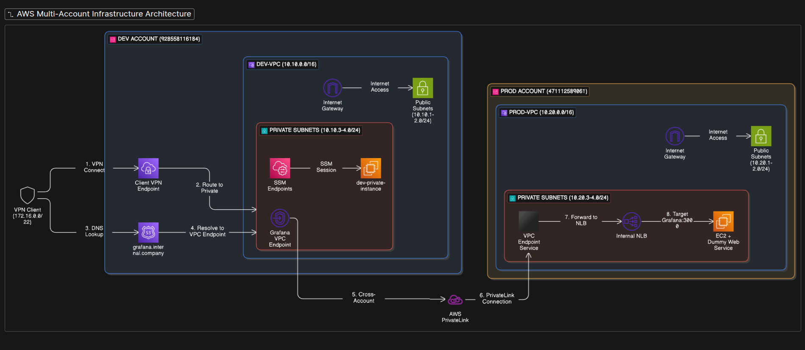

# Cross VPC PrivateLink



This repo contains infrastructure code for connecting AWS VPCs privately across accounts and environments (dev/prod) using AWS PrivateLink. It keeps things isolated and secure, and includes some helper scripts for VPN access.

Directory layout:

```
accounts/
  dev/   # Dev environment
  prod/  # Prod environment
modules/
  iam-cross-account/  # IAM roles for cross-account access
  vpc/                # VPC and networking
```

To use:

1. Clone the repo:
   ```sh
   git clone https://github.com/atakan7/cross-vpc-private-link.git
   cd cross-vpc-private-link
   ```

2. Edit the `terraform.tfvars` files in `accounts/dev` and `accounts/prod` for your setup.

3. Deploy:
   ```sh
   cd accounts/dev   # or accounts/prod
   tofu init
   tofu plan
   tofu apply
   ```

---

## VPN Certificate Registration & Connection

To register your VPN certificates with AWS (for use with a Client VPN endpoint), use the following commands:

Upload the server certificate:
```sh
aws acm import-certificate \
  --certificate fileb://server.crt \
  --private-key fileb://server.key \
  --certificate-chain fileb://ca.crt
```

Upload the client certificate (if using mutual auth):
```sh
aws acm import-certificate \
  --certificate fileb://client.crt \
  --private-key fileb://client.key \
  --certificate-chain fileb://ca.crt
```

After registration, use the returned ACM certificate ARNs in your VPN setup.

To connect to the VPN using OpenVPN:
```sh
openvpn --config ~/Downloads/downloaded-client-config.ovpn \
    --cert client.crt \
    --key client.key \
    --ca ca.crt \
    --dev tun \
    --tls-client \
    --remote-cert-tls server \
    --cipher AES-256-GCM
```
