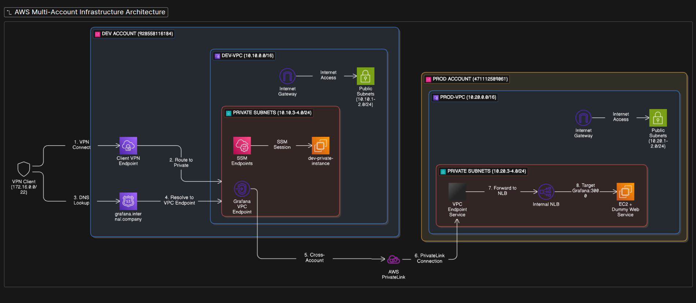

# Cross-Account AWS PrivateLink

**A reproducible infrastructure lab for exposing a private service across AWS accounts, without VPC peering, public IPs, or a bastion host.**

A provider account publishes an internal TCP service through a Network Load Balancer (NLB) and VPC endpoint service. A consumer account reaches it through an interface endpoint, a Route 53 private DNS record, and an AWS Client VPN.



> **Scope:** Security-conscious reference implementation and learning project — **not** a production-ready application. The sample backend has one EC2 instance, speaks plaintext HTTP on port 8080, and uses locally generated demo certificates. See [production considerations](#security-and-limitations).

## How traffic flows

```text
Remote developer
   | AWS Client VPN + certificate
   v
Dev VPC (10.10.0.0/16)
   | Route 53 private DNS: hello.internal.company
   | Interface VPC endpoint (private ENIs)
   v
AWS PrivateLink (provider service allowlist)
   v
Prod VPC (10.20.0.0/16)
   | Internal NLB -> target group -> demo EC2 :8080
   v
JSON response
```

**Why PrivateLink?** The consumer can reach only an explicitly published service, rather than obtaining routed access to the provider VPC as with peering. Access still depends on IAM/service permissions, security groups, application-layer controls, and the service owner's endpoint acceptance policy.

| Component | Role |
| --- | --- |
| [`modules/vpc-core`](modules/vpc-core/) | Isolated VPC and private subnets in two AZs |
| [`modules/privatelink-provider`](modules/privatelink-provider/) | Internal NLB, endpoint service, demo EC2 target |
| [`modules/privatelink-consumer`](modules/privatelink-consumer/) | Interface endpoint, endpoint SG, Route 53 private record |
| [`modules/client-vpn`](modules/client-vpn/) | Client VPN with certificate authentication and connection logs |
| [`modules/vpc-ssm-endpoints`](modules/vpc-ssm-endpoints/) | Private AWS Systems Manager connectivity |
| [`envs/prod`](envs/prod/) / [`envs/dev`](envs/dev/) | Independently owned infrastructure states |

## Deploy the lab

**Requirements:** Two different AWS accounts; AWS CLI v2 profiles named `prod` and `dev` (or set `PROD_PROFILE` / `DEV_PROFILE`); OpenTofu 1.10; OpenSSL; `curl`; a Linux shell. The deployed VPC endpoint, NLB, VPN, EC2, and other AWS resources **cost money**.

1. **Prepare state backends.** In each account, provision a versioned, private S3 state bucket and a DynamoDB lock table with a string partition key `LockID`. Copy `envs/prod/backend.hcl.example` to `envs/prod/backend.hcl`, and the corresponding file for dev. Fill in real backend names. These local configs are git-ignored.
2. **Check identity.** Verify `aws sts get-caller-identity --profile prod` and `--profile dev` refer to different accounts. Profiles need permissions to manage the resources in this repository, the state bucket and lock table.
3. **Run the interactive deployment.**

```bash
bash first-run.sh
```

The script checks prerequisites and AWS identities, creates **demo-only** VPN certificates, imports them into ACM, applies the provider stack, passes its **service-name output** to the consumer stack, then exports `dev.ovpn`. It stops on failures and shows OpenTofu's approval prompts; it does **not** perform unattended applies.

If you use non-default profiles:

```bash
DEV_PROFILE=dev-sandbox PROD_PROFILE=prod-sandbox bash first-run.sh
```

**Manual deployment:** Use [provider](envs/prod/README.md) and [consumer](envs/dev/README.md) instructions. The consumer takes a `privatelink_service_name` variable rather than reading the producer's full Terraform state. This is intentional to avoid cross-account access to sensitive infrastructure state.

## Verify the path

```bash
sudo openvpn --config dev.ovpn \
  --cert scripts/certs/client.crt \
  --key scripts/certs/client.key \
  --ca scripts/certs/ca.crt

# Run in another terminal after the VPN and private DNS are working:
bash scripts/60_test_privateline.sh
```

Expected response: a JSON object with `message: "Hello from provider"` and a UTC timestamp. If DNS doesn't resolve, confirm that your OS's VPN DNS integration is using the VPC resolver (`10.10.0.2`) for `internal.company`. **Do not permanently overwrite `/etc/resolv.conf`**; configure per-link/conditional DNS instead.

See [architecture, verification and troubleshooting](docs/operations.md) or the [companion walkthrough](docs/README.md).

## Quality gates

Pull requests run OpenTofu formatting/validation, shell syntax checks, and a Trivy IaC configuration scan. CI only validates source code: it does **not** use AWS credentials, plan against remote state, or provision infrastructure.

Local equivalent (after installing OpenTofu):

```bash
tofu fmt -check -recursive
tofu -chdir=envs/prod init -backend=false
tofu -chdir=envs/prod validate
tofu -chdir=envs/dev init -backend=false
tofu -chdir=envs/dev validate
```

Commit generated `.terraform.lock.hcl` files after initial provider initialization to make provider selection repeatable.

## Security and limitations

- Private subnets have **no** internet gateway or NAT. The demo uses an Amazon Linux 2023 AMI with Python preinstalled, IMDSv2 required, and encrypted root storage.
- The backend security group accepts the service port only from the **provider VPC CIDR**. Consumer endpoint ingress is limited to dev VPC and VPN client CIDRs; the service allows only the configured consumer account principal.
- **No claim of zero trust:** the sample auto-accepts connections from allowed principals, authorizes certificate-authenticated VPN clients across the dev VPC, and uses plaintext demo HTTP. Production requires narrower identities/rules, app authentication, TLS end-to-end, endpoint approvals, observability, backups, and multiple healthy backend targets.
- Terraform **state may contain sensitive data**. Backends are per-account and must be access-controlled, encrypted, and versioned. The consumer receives the provider's service name, not the provider state file.
- Local private keys in `scripts/certs/` and downloaded VPN profiles must not be shared or committed; the example certificates are **not** for real users.
- AWS PrivateLink and Client VPN incur ongoing hourly/data charges even while idle.

## Teardown

```bash
bash scripts/70_destroy_all.sh
# or, for deliberate non-interactive cleanup:
bash scripts/70_destroy_all.sh --yes
```

The consumer is destroyed before the provider. Imported ACM certificates and the separately provisioned S3/DynamoDB state infrastructure are **not** destroyed by this script. Remove them separately after confirming they are no longer in use.
