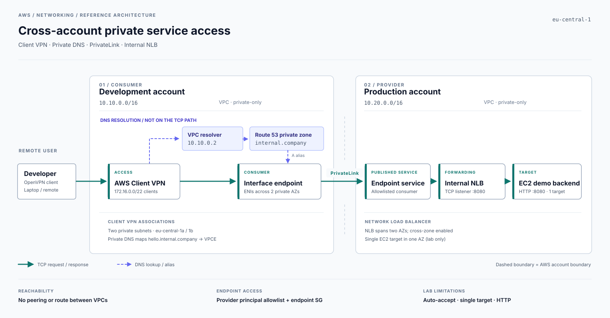

# Cross-account AWS PrivateLink

Private TCP service access across two AWS accounts, without VPC peering or public backend addresses. OpenTofu provisions the network and a small EC2 HTTP service for verification.



## Topology

| Consumer (dev) | Provider (prod) |
| --- | --- |
| Client VPN · Route 53 private zone · interface endpoint | Endpoint service · internal NLB · EC2 target |
| `10.10.0.0/16` | `10.20.0.0/16` |

`hello.internal.company:8080` resolves to the consumer endpoint. TCP traffic then traverses PrivateLink to the provider NLB and demo EC2 instance. DNS is a separate lookup, not a network hop.

Source: [network diagram (SVG)](img/architecture.svg). Details and failure checks: [operations](docs/operations.md).

## Deploy

Requires two AWS accounts, AWS CLI profiles `dev` and `prod`, OpenTofu 1.10, OpenSSL and a Linux shell. **Resources incur AWS charges.**

First, provision a private, versioned S3 state bucket and DynamoDB lock table (`LockID` string key) in **each** account. Configure the backend files:

```bash
cp envs/dev/backend.hcl.example envs/dev/backend.hcl
cp envs/prod/backend.hcl.example envs/prod/backend.hcl
# Edit both backend.hcl files with actual bucket and lock table names.
```

Check the two identities, then run the guided deployment:

```bash
aws sts get-caller-identity --profile dev
aws sts get-caller-identity --profile prod
bash first-run.sh
```

The script generates demo VPN certificates, imports them to ACM, deploys **prod then dev**, and exports `dev.ovpn`. OpenTofu applies require confirmation. Set `DEV_PROFILE` and `PROD_PROFILE` to override profile names.

## Verify

```bash
sudo openvpn --config dev.ovpn \
  --cert scripts/certs/client.crt \
  --key scripts/certs/client.key \
  --ca scripts/certs/ca.crt

# In a second terminal:
bash scripts/60_test_privateline.sh
```

Expected: JSON containing `"message": "Hello from provider"`. If DNS fails, check that the VPN client resolves `internal.company` using the dev VPC resolver (`10.10.0.2`). Do not overwrite system-wide `/etc/resolv.conf` to work around this.

## Check locally

```bash
tofu fmt -check -recursive
tofu -chdir=envs/prod init -backend=false && tofu -chdir=envs/prod validate
tofu -chdir=envs/dev init -backend=false && tofu -chdir=envs/dev validate
python3 -m unittest discover -s tests -p 'test_*.py' -v
```

CI additionally runs Trivy IaC checks. The offline tests mock two AWS accounts and exercise a local HTTP proxy chain; **they do not validate deployed AWS networking or VPN negotiation**.

## Teardown

```bash
bash scripts/70_destroy_all.sh
```

Destroys dev before prod. Imported ACM certificates and state backends remain for manual cleanup.

## Limits

This is a **reference lab**, not production infrastructure: one EC2 target, plaintext HTTP, automatically accepted allowlisted endpoints, broad VPC-level VPN authorization, and self-signed demo certificates. Use TLS, application auth, narrower access controls, redundant targets, and managed certificate lifecycle before using the pattern for a real workload.

For stack-specific inputs, see [dev](envs/dev/README.md) and [prod](envs/prod/README.md).